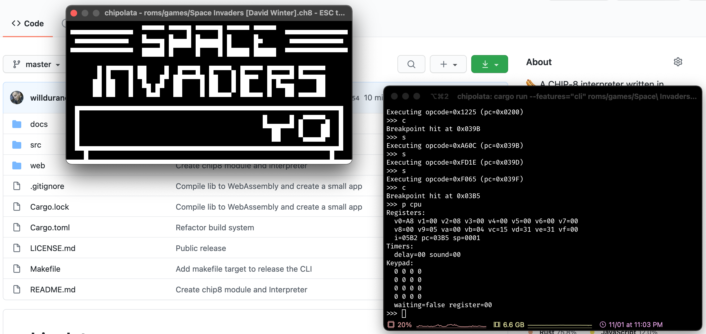

# chipolata

This project is a [CHIP-8](https://en.wikipedia.org/wiki/CHIP-8) interpreter
written in Rust. It can be compiled and run as a "desktop" program (cross
platform) or web application. The "desktop" program provides a simple yet useful
console debugger too.



## Usage

### Desktop

The "desktop" program should be run from the command line interface (console):

```
$ chipolata
chipolata 1.0.0

USAGE:
    chipolata [FLAGS] [OPTIONS] <rom-name>

FLAGS:
    -d, --debug      Enable debug mode (debugger)
    -h, --help       Prints help information
    -V, --version    Prints version information

OPTIONS:
        --speed <speed>     [default: 8]

ARGS:
    <rom-name>    The path to a ROM
```

### Web App

See: https://williamdurand.fr/chipolata/

## Development

```
$ make bootstrap
```

### Desktop

You can build and run the "desktop" app with the following command:

```
$ make cli-dev rom=<path to rom>
```

Type <kbd>o</kbd> in the display window to start the debugger (in the console).

### Web App

You can build and run the web app in development mode with the following
command:

```
$ make dev
```

## Links

- https://en.wikipedia.org/wiki/CHIP-8
- http://www.multigesture.net/articles/how-to-write-an-emulator-chip-8-interpreter/
- http://www.multigesture.net/wp-content/uploads/mirror/goldroad/chip8_instruction_set.shtml
- http://devernay.free.fr/hacks/chip8/C8TECH10.HTM
- https://tobiasvl.github.io/blog/write-a-chip-8-emulator/

## License

chipolata is released under the MIT License. See the bundled
[LICENSE](./LICENSE.md) file for details.
